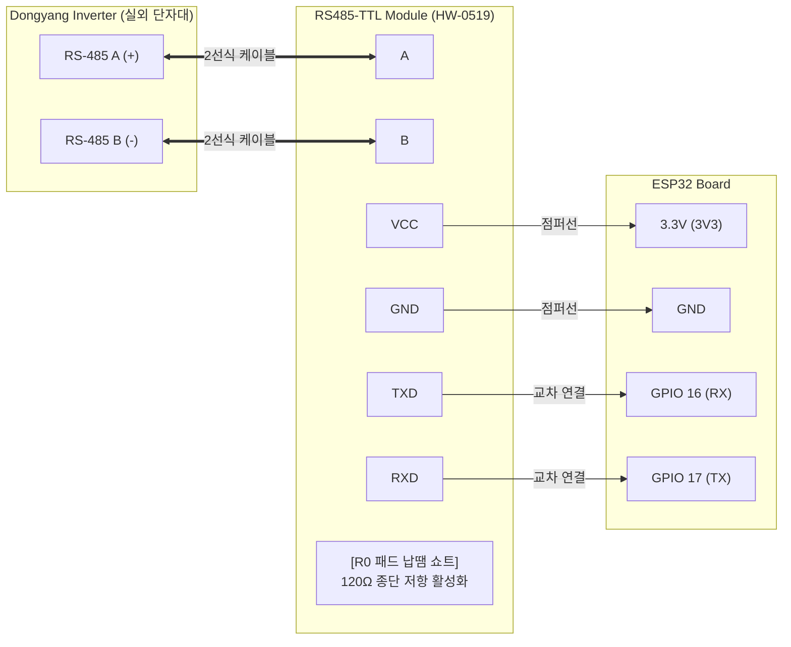

# ☀️ Dongyang Solar Inverter to Home Assistant (via ESPHome)

[](https://esphome.io/)
[](https://www.home-assistant.io/)
[](https://opensource.org/licenses/MIT)

**동양 E&P(Dongyang E&P)** 및 **다스텍(Dastech)** 계열의 가정용 태양광 인버터 데이터를 **ESP32**와 **ESPHome**을 통해 **Home Assistant(홈어시스턴트)**로 실시간 연동하는 고성능 오픈소스 모니터링 시스템입니다.

단독 인버터 1대(3kW) 구성은 물론, 2대 병렬(Dual Daisy-chain) 구성까지 모두 완벽하게 지원합니다.

---

## 🌟 주요 특징 (Key Features)

* **⚡ RS-485 통신 에러 0% 달성:**
  * 송신 전 수신 FIFO 자동 비우기(`flush_rx()`)
  * `0xB1 0xB7` 슬라이딩 윈도우(Sliding Window) 프레임 재정렬 알고리즘 적용 (노이즈 동기 이탈 방지)
  * 인버터 간 1초 논블로킹 상태 머신 대기 로직 탑재 (신호 충돌 방지)
* **💾 NVS 영구 보존 및 플래시 메모리 수명 보호:**
  * 일몰 후 인버터 내부 전원이 꺼지거나 ESP32가 재부팅되어도 **오늘 발전량(`energy_today`)**과 **누적 발전량(`energy_total`)**이 `unknown`이나 `0`으로 초기화되지 않고 직전 수치를 안전하게 복구·유지
  * 5분 버퍼링 커밋(`flash_write_interval: 5min`)으로 ESP32 플래시 메모리 쓰기 수명을 10년 이상 보호
* **📡 패시브 Bluetooth Proxy 병행 구동:**
  * `bluetooth_proxy: active: false` 설정으로 인버터 시리얼 통신에 부하를 주지 않으면서 주변 BLE 비콘 패킷을 홈어시스턴트로 자동 중계
* **📊 홈어시스턴트 에너지 대시보드 공식 완벽 호환:**
  * 별도의 복잡한 리만 합(Riemann sum) 적분 변환 없이도 홈어시스턴트 공식 "에너지(Energy)" 대시보드의 태양광 발전 항목에 1클릭 매핑 가능

---

## 🔌 하드웨어 배선 요약 (Hardware Summary)

ESP32와 **자동 흐름 제어(Auto-direction)**가 지원되는 RS-485 to TTL 모듈(예: HW-0519)을 연결합니다.



> 📖 **초보자를 위한 자세한 부품 구매 안내, 인버터 하부 분해, 딥스위치 세팅, 실외 방수 박스 설치 방법은 [상세 하드웨어 조립 설명서](docs/hardware_assembly_guide.md)를 참고하세요.**

---

## 💻 홈 어시스턴트(Home Assistant) 설치 가이드

### 1단계: ESPHome 애드온 준비
1. Home Assistant 화면에서 **설정 > 부가기능(Add-ons) > 애드온 스토어**로 이동합니다.
2. **ESPHome** 애드온을 검색하여 설치하고 시작합니다. (좌측 사이드바에 표시 켜기)

### 2단계: 설정 파일 다운로드 및 배치
1. 이 저장소의 `esphome/` 폴더에 있는 파일들을 다운로드합니다.
   * `dongyang_inverter.h`: 인버터 통신 C++ 커스텀 컴포넌트 (**필수**)
   * `solar_inverter_single.yaml` (인버터 1대 구성 시) 또는 `solar_inverter_dual.yaml` (인버터 2대 병렬 구성 시)
   * `secrets.yaml.example`
2. Home Assistant의 파일 관리 애드온(File Editor 또는 Samba Share 등)을 통해 홈어시스턴트 내부의 `/config/esphome/` 경로에 위 파일들을 복사합니다.

### 3단계: Wi-Fi 및 개인 비밀번호 설정 (`secrets.yaml`)
1. `/config/esphome/` 폴더 안의 `secrets.yaml.example` 파일의 이름을 **`secrets.yaml`**로 변경합니다. (기존에 이미 `secrets.yaml`이 있다면 내용을 추가합니다.)
2. `secrets.yaml` 파일을 열고 사용 중인 가정용 Wi-Fi 정보를 입력합니다.
   ```yaml
   wifi_ssid: "MyHome_WiFi"
   wifi_password: "MyPassword1234!"
   fallback_password: "MyEmergencyPassword123!"
   ```
3. 사용하실 YAML 파일(`solar_inverter_single.yaml` 또는 `solar_inverter_dual.yaml`)의 상단 보드 설정이 본인의 ESP32 보드와 일치하는지 확인합니다.
   * ESP32-S3 사용 시: `board: esp32-s3-devkitc-1` (기본값)
   * 일반 ESP32 사용 시: `board: esp32dev` 로 수정
4. **인버터 통신 ID 입력:** 인버터 본체 측면 라벨의 **시리얼 번호(S/N) 끝 2자리 숫자**를 확인한 후, YAML 파일의 `my_inv_global->set_inv1_id(숫자);` 에 10진수 그대로 입력합니다. (예: S/N 끝이 `02`면 `2`, `15`면 `15`, `97`이면 `97`)

### 4단계: ESP32 최초 펌웨어 플래싱
1. **최초 1회 유선 설치:**
   * ESP32를 PC의 USB 포트에 연결한 후 Chrome 브라우저에서 [web.esphome.io](https://web.esphome.io)로 접속하거나,
   * Home Assistant의 ESPHome 대시보드에서 해당 장치의 **[Install] > [Plug into this computer]**를 선택하여 최초 펌웨어를 업로드합니다.
2. **이후 무선 원격 업데이트(OTA):**
   * 최초 설치 완료 후 Wi-Fi에 연결되면, 이후 코드 수정이나 튜닝 시에는 선을 연결할 필요 없이 **[Install] > [Wirelessly]**를 눌러 무선으로 업데이트할 수 있습니다.

### 5단계: Home Assistant 기기 자동 감지 및 엔티티 확인
1. 펌웨어 설치가 완료되면 Home Assistant의 **설정 > 기기 및 서비스**에 새 ESPHome 장치(`Solar Inverter Monitor`)가 자동으로 발견(Discovery)됩니다.
2. **[구성(Configure)]**을 누르고 제출하면 모든 인버터 측정 센서가 자동으로 등록됩니다.
   * **실시간 발전 출력:** `sensor.solar_inverter_total_ac_power` (W)
   * **금일 발전량:** `sensor.solar_inverter_total_energy_today` (kWh)
   * **누적 발전량:** `sensor.solar_inverter_total_energy` (kWh)
   * **전압/전류/온도:** `sensor.solar_inverter_inv1_ac_power`, `sensor.solar_inverter_inv1_temperature` 등

### 6단계: HA 에너지 대시보드(Energy Dashboard) 연동
1. Home Assistant **설정 > 대시보드 > 에너지** 메뉴로 이동합니다.
2. **"태양광 패널(Solar panels)"** 항목에서 **[태양광 생산량 추가(Add solar production)]**를 클릭합니다.
3. 에너지 센서로 **`sensor.solar_inverter_total_energy`** 를 선택하고 저장합니다. (1대 단독/2대 병렬 모두 동일)
4. 이제 홈어시스턴트 공식 에너지 플로우 다이어그램에서 실시간 발전량과 일일 통계가 자동으로 그래프에 반영됩니다!

---

## 📚 관련 기술 문서 (Documentation)

* 🛠 **[상세 하드웨어 조립 및 결선 설명서](docs/hardware_assembly_guide.md):** 부품 구매 목록(BOM), 인버터 단자대 분해, 120Ω 종단 저항 납땜, 실외 방수 하이박스 설치 가이드
* 📑 **[Hex 통신 프로토콜 명세서](docs/protocol_spec.md):** 동양 E&P 32바이트 응답 패킷 구조, XOR 체크섬 공식, 리틀 엔디언 변환표
* 📊 **[추천 러브레이스 대시보드 카드 예제](ha/lovelace_card_example.yaml):** 홈어시스턴트 대시보드에 복사해 넣는 Mushroom / 모니터링 카드 YAML 템플릿

---

## 🤝 기여 및 피드백 (Contributing)

버그 제보나 프로토콜 개선 아이디어는 언제든지 [GitHub Issues](https://github.com/)를 통해 남겨주세요. 풀 리퀘스트(Pull Request)는 언제나 환영합니다!

---

## 📄 라이선스 (License)

이 프로젝트는 [MIT License](LICENSE)에 따라 자유롭게 사용, 수정, 배포할 수 있습니다.
