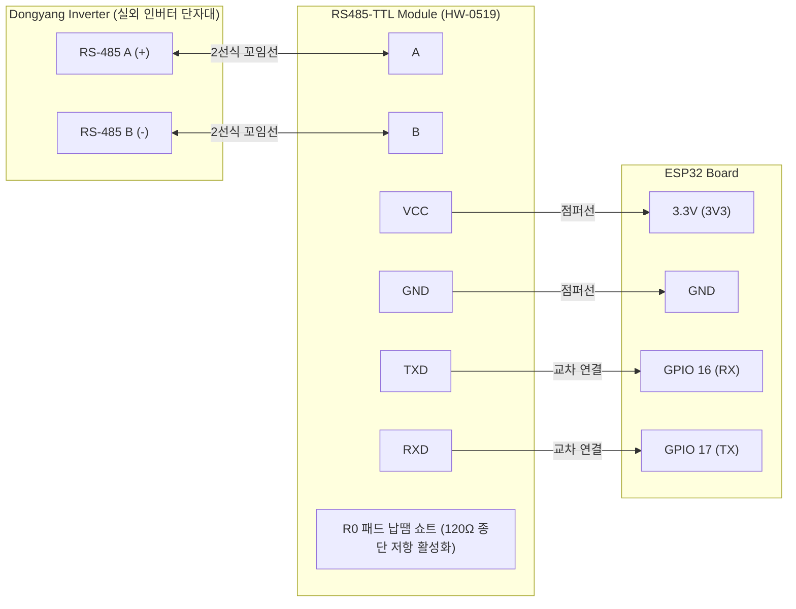

# 🛠 동양/다스텍 태양광 인버터 모니터링 하드웨어 조립 및 결선 가이드

이 문서는 동양 E&P(Dongyang E&P) 및 다스텍(Dastech) 계열 태양광 인버터의 RS-485 통신 포트와 ESP32를 연결하여 자작 모니터링 장치를 제작하고 실외에 안전하게 설치하는 전 과정을 다룹니다.

---

## ⚠️ 1. 안전 수칙 (Safety First)

> [!CAUTION]
> **고전압 감전 주의!**
> 태양광 인버터 내부에는 태양광 패널에서 인입되는 **수백 볼트(DC 200~500V)**의 고전압과 한전 계통 연계 **교류 전압(AC 220V/380V)**이 함께 흐르고 있습니다.
> 
> * 작업 시작 전 반드시 인버터 하단의 **DC 스위치(PV 차단기)**를 **OFF**로 돌리세요.
> * 주택 분전함의 **태양광 발전 AC 차단기**를 반드시 내려 전원을 완전 차단하세요.
> * 인버터 내부의 대용량 커패시터가 방전될 때까지 전원 차단 후 **최소 5분 이상 대기**한 후 커버를 열어주세요.
> * RS-485 통신 단자는 저전압 신호선이지만, 주변 고압 배선과 닿지 않도록 주의해서 작업하세요.

---

## 📦 2. 부품 준비물 (BOM - Bill of Materials)

| 부품명 | 권장 규격 / 모델명 | 수량 | 필수 확인 사항 / 비고 |
| :--- | :--- | :---: | :--- |
| **ESP32 개발 보드** | ESP32-S3 DevKitC-1 (또는 ESP32 DevKit v1) | 1개 | Wi-Fi 및 Bluetooth LE 지원. 듀얼코어로 안정적 동작 |
| **RS-485 to TTL 모듈** | **HW-0519** 또는 **MAX13487** 기반 모듈 | 1개 | ⚠️ **반드시 "자동 흐름 제어(Auto-direction)" 지원 모듈 구매** (TX/RX 신호만으로 자동 송수신 전환되는 모듈) |
| **통신 케이블** | 2선식 꼬임선 (AWG22~24 또는 UTP 랜선) | 수 미터 | 인버터와 모니터링 장치 간 거리만큼 준비 |
| **점퍼 와이어** | 암-암(Female-Female) 듀폰 케이블 | 4가닥 | ESP32와 RS-485 모듈 간 연결용 |
| **전원 공급 장치** | 5V 1A~2A USB 전원 어댑터 및 케이블 | 1세트 | ESP32 전원 공급용 (실외 콘센트 연결) |
| **실외용 방수 하이박스** | IP65 이상 방수 플라스틱 박스 (약 150x100x70mm) | 1개 | 케이블 인입용 방수 케이블 글랜드(PG7 등) 포함 권장 |
| **인두기 및 땜납** | 기본 납땜 도구 | 1세트 | RS-485 모듈의 종단 저항(R0) 활성화 작업용 |

---

## 🔌 3. 하드웨어 배선도 (Wiring Diagram)



### 핀 연결 상세 요약표

| RS-485 모듈 핀 | ESP32 핀 | 전선 역할 | 주의사항 |
| :--- | :--- | :--- | :--- |
| **VCC** | **3.3V (3V3)** | 전원 공급 | ⚠️ **5V가 아닌 3.3V에 연결하세요.** (ESP32 입출력 전압 레벨 3.3V 일치) |
| **GND** | **GND** | 접지선 | 공통 접지 연결 |
| **TXD** | **GPIO 16 (RX)** | 데이터 수신 | 모듈 TXD ➜ ESP32 RXD (교차 연결) |
| **RXD** | **GPIO 17 (TX)** | 데이터 송신 | 모듈 RXD ➜ ESP32 TXD (교차 연결) |
| **A** | 인버터 **A (+)** | RS-485 Differential (+) | 극성 준수 |
| **B** | 인버터 **B (-)** | RS-485 Differential (-) | 극성 준수 |

---

## 🔧 4. 단계별 상세 조립 및 결선 절차

### 1단계: RS-485 모듈 종단 저항(120Ω) 활성화
1. 구매한 RS-485 모듈(HW-0519 등)의 뒷면 또는 앞면 기판을 확인합니다.
2. 기판에 **`R0`** 또는 **`120Ω`**라고 표기된 작은 2개의 금색 패드가 있습니다.
3. 인두기를 사용하여 이 두 패드를 **납으로 이어 붙여(Solder Bridge / 쇼트)** 줍니다.
   > **💡 이유:** 통신선이 길어지면 신호가 끝단에서 반사되어 잡음(Noise)이 발생합니다. 120Ω 종단 저항을 활성화하면 신호 반사를 흡수하여 패킷 에러율을 0%로 안정화시킵니다.

### 2단계: ESP32와 RS-485 모듈 결선
1. 듀폰 점퍼선을 이용해 위 핀맵 표대로 ESP32와 RS-485 모듈을 연결합니다.
2. 전원선은 반드시 ESP32의 **`3.3V`** 핀에 연결합니다.
3. 시리얼 통신선은 **TX ↔ RX 교차**로 연결되었는지 다시 한 번 확인합니다. (모듈 TXD ➜ ESP32 GPIO 16, 모듈 RXD ➜ ESP32 GPIO 17)

### 3단계: 인버터 하부 통신 단자 찾기
1. 인버터의 DC 스위치와 AC 차단기가 모두 차단되었는지 확인합니다.
2.일부 모델은 커버 분리 필요 없이 하부에 항공잭 나사식 캡을 풀면 바로 연결이 가능합니다.
3. 인버터 하단부에 별도 커버가 있는 경우에는 고정 나사(보통 4개)를 십자드라이버로 풀고 배선실 커버를 조심스럽게 엽니다.
4. 커버가 있는 경우 안쪽 PCB 기판 또는 단자대에서 **`RS-485`**, **`485+` / `485-`**, 또는 **`A` / `B`**로 표기된 단자를 찾습니다.
   * 일부 모델은 나사식 터미널 블록 형태이며, 일부 모델은 RJ45(랜선) 포트 형태로 되어 있습니다.
   * 나사식 단자대의 경우 `A` 단자에 통신선의 1번 선, `B` 단자에 2번 선을 물리고 단단히 조여줍니다.
5. 기타 상세 연결 방법은 모델 별 매뉴얼을 참고합니다.

### 4단계: 인버터 통신 ID 확인 및 설정 (핵심!)
동양/다스텍 인버터는 질의 시 본인의 통신 ID와 정확히 일치할 때만 데이터를 회신합니다.

> 🔍 **통신 ID 확인 방법: 기기 시리얼 번호(S/N)의 마지막 2자리!**
> 
> * 동양 인버터의 통신 국번(ID)은 **인버터 본체 측면(또는 하부) 은색 라벨에 적힌 시리얼 번호(S/N)의 맨 끝 2자리 숫자**로 공장 출하 시 기본 지정되어 있습니다.
>   * 예: 시리얼 번호가 `...02` 로 끝나는 경우 ➜ 통신 ID는 **`2`** (`0x02`)
>   * 예: 시리얼 번호가 `...15` 로 끝나는 경우 ➜ 통신 ID는 **`15`** (`0x0F`)
>   * 예: 시리얼 번호가 `...97` 로 끝나는 경우 ➜ 통신 ID는 **`97`** (`0x61`)
> * 복잡하게 인버터 LCD 설정 메뉴를 찾거나 기판 내부 딥스위치를 만질 필요 없이, **시리얼 스티커 끝 2자리 숫자**만 확인하시면 됩니다!

#### 코드(YAML)에서 본인 ID 입력하기
확인한 끝 2자리 숫자를 YAML 파일의 `on_boot` 섹션에 **10진수 그대로** 입력하시면 됩니다:
* **1대 단독 인버터 (`solar_inverter_single.yaml`):**
  ```cpp
  // 본인 인버터 시리얼 번호 끝 2자리 숫자를 그대로 입력하세요 (예: 2번인 경우 2, 1번인 경우 1)
  my_inv_global->set_inv1_id(2);
  ```
* **2대 병렬 인버터 (`solar_inverter_dual.yaml`):**
  ```cpp
  // 각 인버터의 시리얼 번호 끝 2자리 숫자를 각각 입력하세요
  my_inv_global->set_inv1_id(2);   // 1번 인버터 시리얼 끝 2자리
  my_inv_global->set_inv2_id(97);  // 2번 인버터 시리얼 끝 2자리
  ```
  *(※ 2대 병렬 시: 1번 인버터의 A와 2번 인버터의 A를 서로 연결하고, B와 B를 서로 연결(데이지 체인)한 뒤 RS-485 모듈의 A, B에 결선합니다.)*

---

## 🌧 5. 실외 설치 및 방수 대책

인버터는 보통 야외나 보일러실 외벽에 설치되므로 비바람과 결로, 직사광선에 대한 방비가 필수적입니다.

1. **하이박스 배치:**
   * ESP32 보드와 RS-485 모듈을 방수 하이박스 내부에 넣고 흔들리지 않게 양면폼테이프나 서포터로 고정합니다.
   * 하이박스는 직사광선을 직접 받지 않도록 인버터 본체 하부 그늘이나 처마 밑에 설치하는 것이 좋습니다.
2. **케이블 인입 및 방수 글랜드:**
   * 전원선과 통신선은 하이박스 **아래쪽(하단)**으로 뚫린 구멍을 통해 인입하고, 반드시 **케이블 글랜드**를 조여 빗물이 타고 들어오지 않도록 합니다.
   * 인입선에 아래로 살짝 처지는 **물방울 트랩(Drip Loop)**을 만들어주면 빗물이 하이박스 내부로 유입되는 것을 완벽히 방지할 수 있습니다.
3. **Wi-Fi 신호 점검:**
   * 하이박스를 닫기 전, 실외 설치 위치에서 집 안 공유기의 Wi-Fi 신호(2.4GHz)가 최소 2칸 이상(-75dBm 이상) 잡히는지 스마트폰으로 미리 확인하세요.
